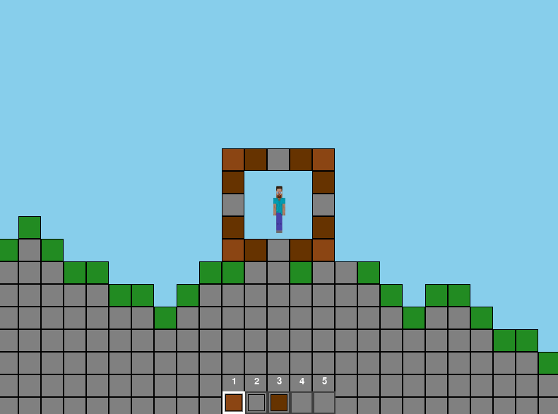

# Minecraft 2D

A 2D implementation of Minecraft using Python and Pygame.



## Features

- Procedurally generated terrain with hills
- Player movement with physics (walking, jumping, gravity)
- Block breaking and placing mechanics
- Multiple block types (dirt, stone, wood)
- Hotbar interface with block selection
- Camera that follows the player
- Collision detection and line of sight checking

## Installation

1. Make sure you have Python 3.x installed
2. Install pygame using pip:

```bash
pip install pygame
```

3. Clone this repository or download the source code
4. Run the game:

```bash
python main.py
```

## Controls

- **A/Left Arrow**: Move left
- **D/Right Arrow**: Move right
- **Space/Up Arrow**: Jump
- **Left Click**: Break blocks
- **Right Click**: Place blocks
- **Mouse Wheel**: Cycle through available blocks
- **Number Keys (1-3)**: Select blocks directly
- **ESC**: Quit game

## Block Types

- **Dirt**: Basic building block
- **Stone**: Found deeper underground
- **Wood**: Building material
- **Grass**: Generated on the surface
- **Bedrock**: Indestructible border blocks

## Project Structure

- `main.py`: Main game loop and UI handling
- `game/`
  - `settings.py`: Game constants and configuration
  - `player.py`: Player class and physics
  - `world.py`: World generation and block management
  - `block.py`: Block class and properties
- `assets/`
  - `steve.png`: Player sprite

## Technical Details

- Block placement checks for:
  - Adjacent blocks (must place next to existing blocks)
  - Player collision (can't place where player stands)
  - Range limit (3 blocks reach)
  - Line of sight (can't place through walls)
- World features:
  - Simple noise-based terrain generation
  - Unbreakable bedrock borders
  - Efficient collision detection using grid coordinates
